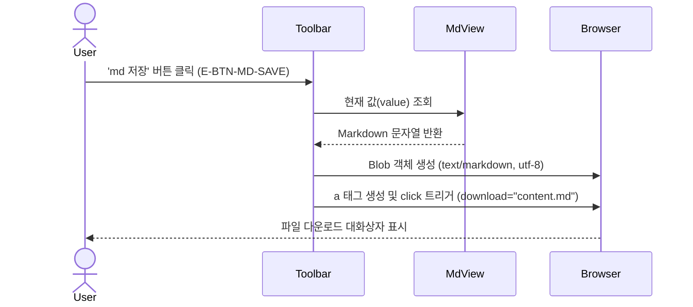
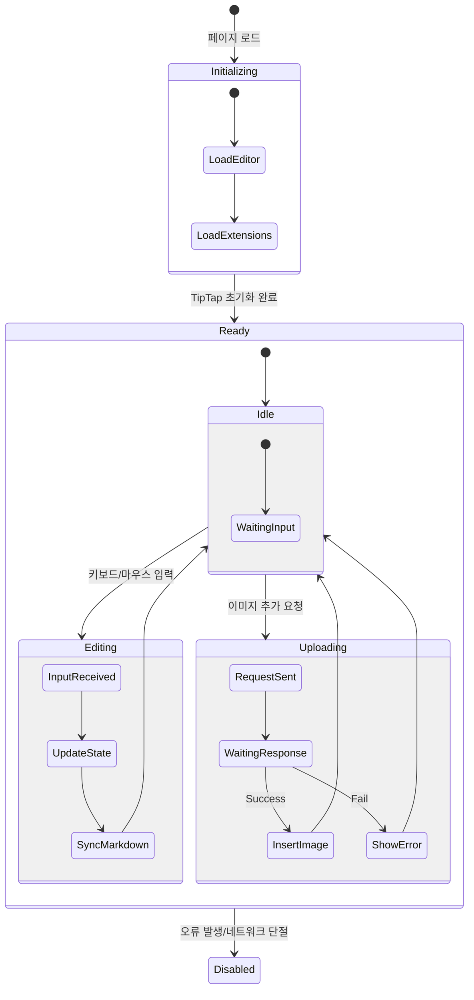

# GUI 인터랙션 흐름 (GUI Flow)

본 문서는 `GUI.md`에 정의된 화면 요소들 간의 상호작용 흐름과 상태 변화를 시각화합니다.
Mermaid Flowchart를 사용하여 사용자의 행동에 따른 데이터 흐름과 UI 피드백을 정의합니다.

## 1. 메인 편집 사이클 (Main Editing Cycle)

사용자가 리치 에디터를 조작할 때 발생하는 데이터 동기화 흐름입니다.

```mermaid
graph TD
    User((사용자))
    
    subgraph Client [브라우저 클라이언트]
        Toolbar[상단 툴바]
        Editor[TipTap 에디터 영역]
        Serializer{Markdown 변환기}
        MdView[Markdown 텍스트 영역]
    end

    User -->|타이핑/서식 변경| Editor
    User -->|버튼 클릭| Toolbar
    Toolbar -->|Command 실행| Editor
    
    Editor -->|OnUpdate 이벤트| Serializer
    Serializer -->|직렬화 (HTML to MD)| MdView
    
    style Editor fill:#e1f5fe,stroke:#01579b
    style MdView fill:#fff3e0,stroke:#ef6c00
    style Serializer fill:#f3e5f5,stroke:#4a148c
```

## 2. 역방향 동기화 흐름 (Reverse Sync)

사용자가 Markdown 소스를 직접 수정하고 에디터에 반영하는 흐름입니다.

```mermaid
graph TD
    User((사용자))
    
    subgraph Client [브라우저 클라이언트]
        MdView[Markdown 텍스트 영역]
        ApplyBtn[반영 버튼 (E-BTN-MD-APPLY)]
        Parser{Markdown 파서}
        Editor[TipTap 에디터 영역]
    end

    User -->|직접 수정| MdView
    User -->|클릭| ApplyBtn
    
    ApplyBtn -->|Get Value| MdView
    MdView -->|Raw Markdown| Parser
    Parser -->|setContent| Editor
    
    note right of Parser
        GitHub Flavored Markdown
        규격에 맞춰 노드 생성
    end note

    style MdView fill:#fff3e0,stroke:#ef6c00
    style ApplyBtn fill:#ffcc80,stroke:#e65100
    style Editor fill:#e1f5fe,stroke:#01579b
```

## 3. 이미지 업로드 인터랙션 (Image Upload Interaction)

버튼, 드래그앤드롭, 붙여넣기 등 다양한 경로로 이미지가 입력될 때의 흐름입니다.

```mermaid
flowchart TD
    User((사용자))
    Start((시작))
    
    subgraph Trigger [트리거 경로]
        BtnClick[버튼 클릭]
        Drop[드래그 & 드롭]
        Paste[붙여넣기 (Ctrl+V)]
    end
    
    subgraph Valid [검증 단계]
        IsImage{이미지 파일인가?}
        IsExtUrl{외부 URL인가?}
        Fetchable{Fetch 가능?}
    end
    
    subgraph Process [처리 단계]
        Loading[로딩 표시]
        UploadAPI[POST /api/upload]
        InsertNode[에디터 이미지 삽입]
        ErrMsg[에러 메시지 표시]
    end

    User --> Start
    Start --> BtnClick & Drop & Paste
    
    BtnClick --> IsImage
    Drop --> IsImage
    Paste --> IsImage
    
    IsImage -- Yes --> Loading
    IsImage -- No (HTML 등) --> IsExtUrl
    
    IsExtUrl -- Yes --> Fetchable
    Fetchable -- Yes --> Loading
    Fetchable -- No --> Stop((중단))
    IsExtUrl -- No --> Stop
    
    Loading --> UploadAPI
    UploadAPI -- 성공 (200) --> InsertNode
    UploadAPI -- 실패 (400/500) --> ErrMsg
    
    InsertNode --> Update[Markdown 뷰 갱신]
    ErrMsg --> Stop

    style Loading fill:#fff9c4,stroke:#fbc02d
    style UploadAPI fill:#ffecb3,stroke:#ff6f00
    style InsertNode fill:#c8e6c9,stroke:#2e7d32
    style ErrMsg fill:#ffcdd2,stroke:#c62828
```

## 4. 파일 저장 흐름 (File Save)

최종 결과물을 파일로 다운로드하는 흐름입니다.



## 5. UI 상태 전이 (UI State Transition)

주요 컴포넌트의 상태 변화를 정의합니다.


